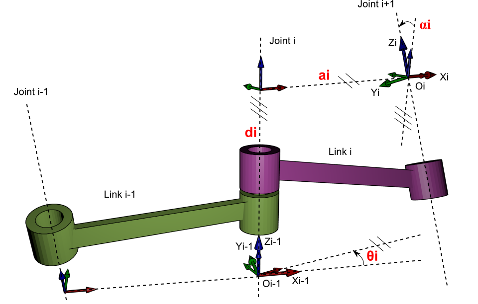
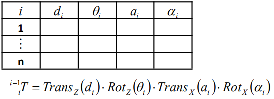
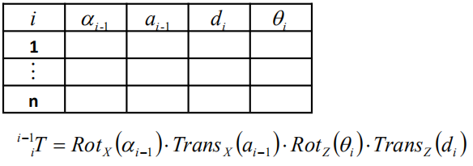

##关于 DH Parameters
DH Parameters 由 Jacques Denavit 和 Richard Hartenberg 于1955年提出，是一种以数学形式描述串联连杆及关节（或臂式机器人）几何结构的方法。
DH parameters 具有多种形式（或惯例），但本质和效果是一致的，都需要一系列连杆坐标系， 4 种参数，在计算正逆运动学时依靠齐次坐标变换的运算法则。通常将 Jacques Denavit 和 Richard Hartenberg 提出的惯例称为 标准 DH 参数（Standard DH Parameters），而其他的一概称为 改进型 DH 参数（Modified DH Parameters）。标准 DH 参数 和 Craig 改进型 DH 参数是两种应用最广泛的惯例。以下将主要阐述这两种 DH 参数的定义及使用。

标准 DH 参数和Craig 改进 DH 参数的定义分别如图所示：

{width=50%}
{width=40%}

从上面两幅图可以很容易地看出二者在定义上的区别：   
1. 标准 DH 参数将连杆的坐标轴安置在连杆远端（右端），而 Craig 改进 DH 参数将连杆的坐标轴安置在连杆近端（左端）   
2. 参数定义上的不同：

3. DH 表格：在经典表示法中下标是一致的，而在 Craig 改进型 DH 参数中，下标是错开的。具体见下表 

