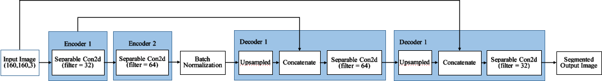
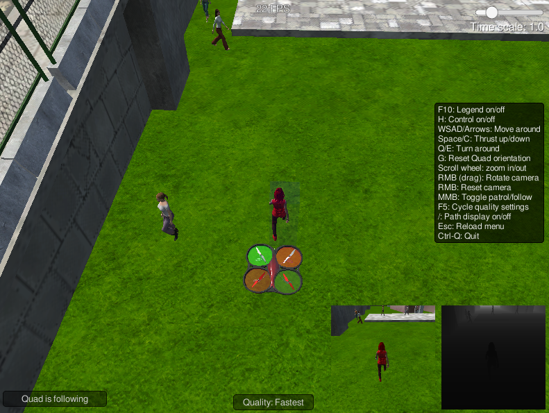

## Deep Learning Project (Follow Me)
In this Follow Me project, segmentation network——a fully convolutional network(FCN) is build and trained for identifying a moving target hero, which can be captured by a simulated drone camera. The model should be robust enough so that the drone will not be disturbed by surrounding environment and follow the target hero as she walk around.    

### 1.Network Architecture
An FCN with the encoder and edcoder structure is used in this project. The architecture of the Network is shown below. 
  

#### Fully Convolutional Networks
An FCN is comprised of an encoder and decoder. The encoder portion is a convolution network that reduces to a deeper 1x1 convolution layer, in contrast to a flat fully connected layer that would be used for basic classification of images. This difference has the effect of preserving spacial information from the image.

#### 1×1 Convolution Layer
The 1x1 convolution layer in the FCN is a regular convolution. Each includes batch normalization with the ReLU activation function applied to the layers. The 1×1 Convolution allows us to shrink (or even increse) the number of channels in volums and also introduce a nonlinear operation. It has influenced many neural network architectures like Inception.    

#### Separable Convolution Layer
Separable convolutions, also known as depthwise separable convolutions, comprise of a convolution performed over each channel of an input layer and followed by a 1x1 convolution that takes the output channels from the previous step and then combines them into an output layer. The reduction in the parameters make separable convolutions quite efficient with improved runtime performance and also have the added benefit of reducing overfitting to an extent, because of the fewer parameters.

#### Batch Normalization
Batch normalization is an additional way to optimize network training. Batch normalization is based on the idea that, instead of just normalizing the inputs to the network, we normalize the inputs to layers within the network. It's called "batch" normalization because during training, we normalize each layer's inputs by using the mean and variance of the values in the current mini-batch.
    
Our `separable_conv2d_batchnorm()` function adds a batch normalization layer after the separable convolution layer, which help model converge much more quickly when training. Morever, using batch normalization allows us to use much higher learning rates. With batch normalization, we can train deeper neural networks without dropout.  

#### Bilinear Upsampling
Bilinear upsampling or bilinear interpolation is a resampling technique that utilizes the weighted average of four nearest known pixels, located diagonally to a given pixel, to estimate a new pixel intensity value. The weighted average is usually distance dependent.

#### Skip Connections & Concatenation
Skip connections is a great way to retain some of the finer details from the previous layers as we decode or upsample the layers to the original size. In this project, we use concatenation but not element-wise addition operation to combining the upsampled layer and a layer with more spatial information than the upsampled one.    

#### IOU   
IOU is Intersection over Union, where the Intersection set is an AND operation (pixels that are truly part of a class AND are classified as part of the class by the network) and the Union is an OR operation (pixels that are truly part of that class + pixels that are classified as part of that class by the network). 

### 2.Training and Hyperparameters Choosing
- learning rate=0.01
- batch size=64
- number of epochs=20
- steps per epoch=200
- validation steps=50    

The learning rate is set to default value. I have also tried using 0.001, and the value does improve the model performance. However, the improvement is very small and the smaller learning rate requires more epoch to train.    

I have try using value of 32, 64, 96 and 128 as the batch size. I found that with larger batch size value, the learning curve is smoother. And With the increase of Batch_Size, the number of epoch needed to achieve the same accuracy is increasing. However, a large batch size is easy to fall into local optimum. I found my model perform well when the batch size is set to be 64.    

At first I set the epoch number a relatively large number to observe the model performance. And I found that both the loss and val_loss decreased. However, when the epoch number is big than 20, the accuracy only improved marginally, and the model may be overfitting. Considering time and performance, I finally chose 20 as the epoch number.    

The BatchIteratorSimple introduce a shift_aug parameter, which lead to generating more trianing images and to some extent, can prevent overfitting. However, it can't produce new training data. The default "steps per epoch" value is good enough, because the raw data can be all used, and  proper data augmentation is introduced. Meanwihle, the training time is acceptable.

After training, the final score is 0.461, while the final IoU is 0.615. The average IOU for the hero when measures how well the neural network can detect the target from far away is 0.327. This is much better than the initial training result.

### 3.Performance
The simulation result is shown below. The drone can track the hero all the time, ignoring the background and other people.  

### 4.Limitations
Training and validation data used here were the default data. Although we can generate some images through data augmentation technique, if we want to further improve the model performance, we need to produce new training data by recording in simulator. 

If we want to track other object, we need to spend time collecting training and validation images of this object and then train the model from scratch. However, we can retain the model structure. 

### 5. Reference   

[https://in.udacity.com/course/robotics-software-engineer--nd209](https://in.udacity.com/course/robotics-software-engineer--nd209)

[https://www.coursera.org/lecture/convolutional-neural-networks/networks-in-networks-and-1x1-convolutions-ZTb8x](https://www.coursera.org/lecture/convolutional-neural-networks/networks-in-networks-and-1x1-convolutions-ZTb8x)  

