## Perception Project
This project is about implementing 3D percetion pipeline using a PR2 robot in simulation environment. The PR2 robot utilizing an RGB-D camera, which allows us to obtain point cloud data.    

The perception pipeline of this project mainly includes three parts:    
1) Filtering and RANSAC Plane Fitting    
2) Clustering for Segmentation    
3) Object Recognition    

### 1. Filtering and RANSAC Plane Fitting
The purpose of this step is to Use filtering and RANSAC plane fitting to isolate the objects of interest from the rest of the scene. The raw point cloud object from the PR2 camera looks like this:

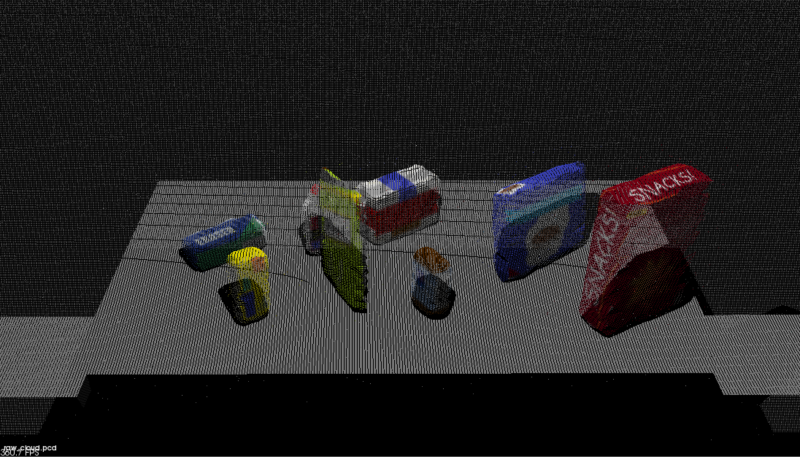
#### 1.1 Outlier Removal Filter
Dust in the environment, humidity in the air, or presence of various light sources may lead to sparse outliers. Such outliers lead to complications in the estimation of point cloud characteristics like curvature, gradients, etc, which might cause failures at various stages in our perception pipeline. PCL’s StatisticalOutlierRemoval filter perform a statistical analysis in the neighborhood of each point, and remove those points which do not meet a certain criteria.   

I found a mean k value of 20 and a standard deviation threshold of 0.2 can handle this problem. Point cloud after applying outlier removal filter looks like this: 

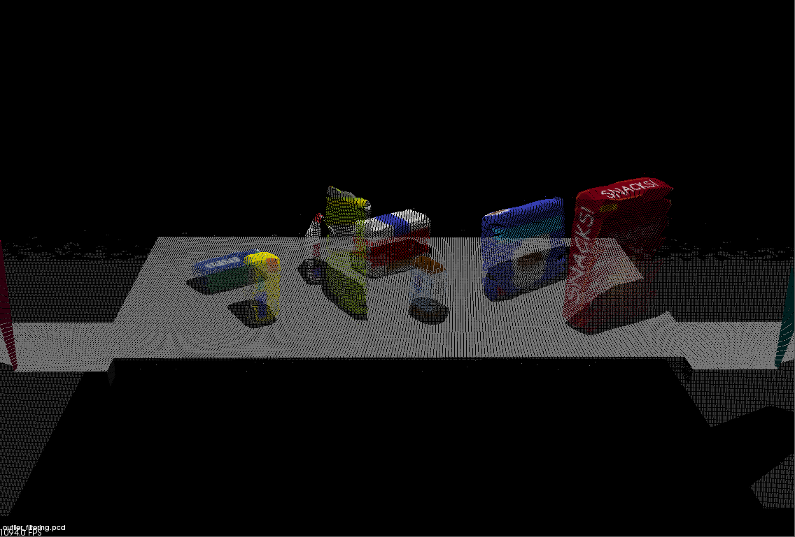

#### 1.2 Voxel Grid Filter
A voxel grid filter allows us to downsample the data by taking a spatial average of the points in the cloud confined by each voxel. PCL provides a handy function to perform VoxelGrid downsampling.    

I use a `LEAF_SIZE` of 0.01. This is a good compromise of leaving enough feature detail while minimizing processing time. However, a large LEAF_SIZE will take up too much system resources.    

Point cloud after applying Voxel Grid Filter looks like this: 

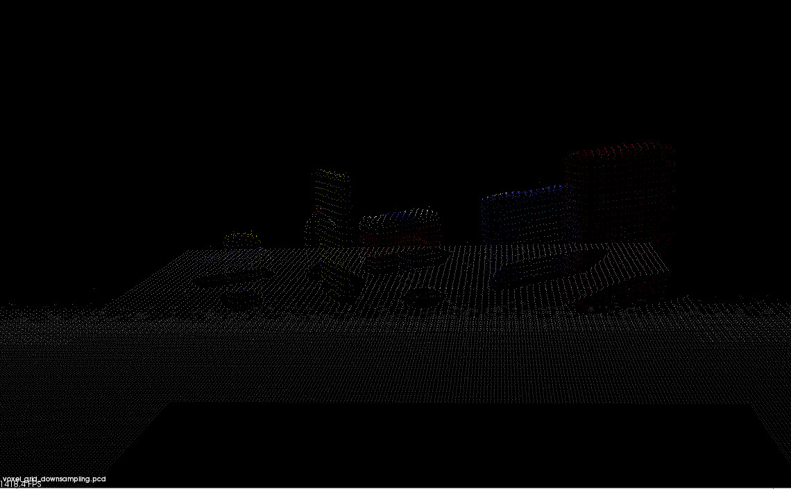

#### 1.3 Passthrough Filter
The Pass Through Filter works much like a cropping tool, which allows us to crop any given 3D point cloud by specifying an axis with cut-off values along that axis. The premise is that we must know the location of the target in the scene.    

In this project, we need passthrough filters for both the Y and Z axis. This allows us to remove areas that we are not interested in. For the Y axis, I used a range of -0.45 to 0.45, and for the Z axis, I used a range of 0.6 to 1.3.    

Point cloud after applying Passthrough Filter looks like this: 

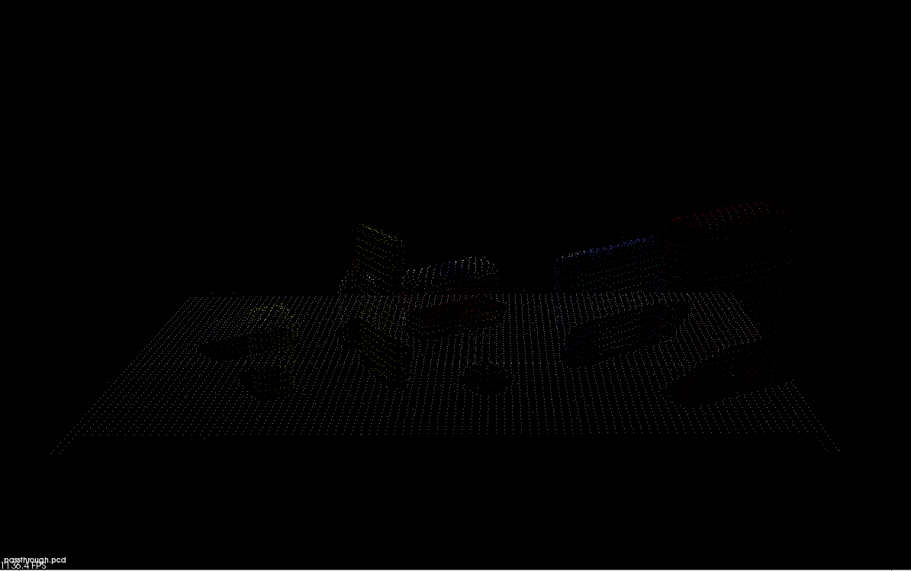

#### 1.4 RANSAC Plane Segmentation
RANSAC is an algorithm, that we can use to identify points in our dataset that belong to a particular model. The RANSAC algorithm assumes that all of the data in a dataset is composed of both inliers and outliers, where inliers can be defined by a particular model with a specific set of parameters, while outliers do not fit that model and hence can be discarded. In this project, point cloud belong to table is inliers, while others is outliers.

I set RANSAC max distance value as 0.01.    
The extracted inliers represent table and look like this:

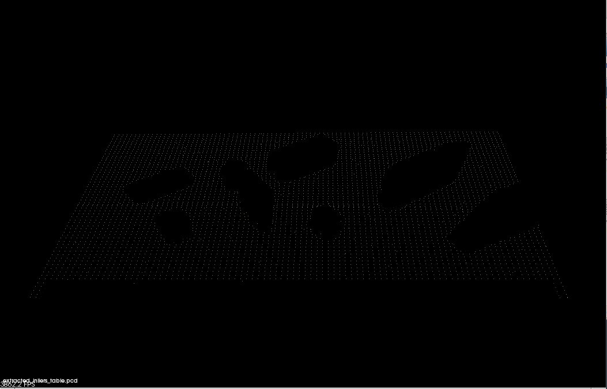

The extracted outliers represent the objects on the table, which look like this:

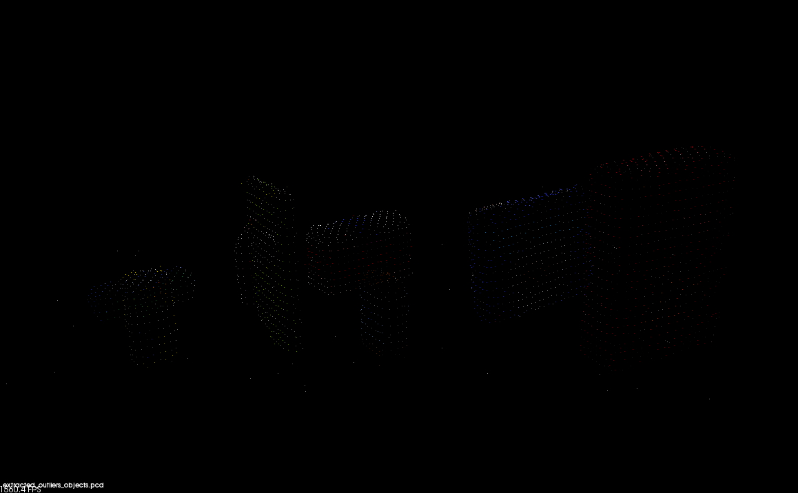

### 2. Clustering for Segmentation  
In this project, I use DBSCAN algorithm to perform segmentation task. The DBSCAN algorithm creates clusters by grouping data points that are within some threshold distance from the nearest other point in the data. This algorithm is a nice alternative to k-means when we don' t know how many clusters to expect in our data, but we do know something about how the points should be clustered in terms of density.     

Performing a DBSCAN required converting the XYZRGB point cloud to a XYZ point cloud, making a k-d tree, preparing the Euclidean clustering function, and extracting the clusters from the cloud. The code for DBSCAN is shown below:   

    # TODO: Euclidean Clustering
    white_cloud = XYZRGB_to_XYZ(extracted_outliers_objects)
    tree = white_cloud.make_kdtree()

    # TODO: Create Cluster-Mask Point Cloud to visualize each cluster separately
    ec = white_cloud.make_EuclideanClusterExtraction()
    ec.set_ClusterTolerance(0.015)
    ec.set_MinClusterSize(20)
    ec.set_MaxClusterSize(1500)

    ec.set_SearchMethod(tree)
    # Extract indices for each of the discovered clusters
    cluster_indices = ec.Extract()

After applying DBSCAN algorithm, the cluster cloud is obtained.

### 3. Object Recognition
In this step, we must extract features and train an SVM model on new objects. 

#### 3.1 Collecting Training Data (Capture Object Features)
Before we can train our SVM, we'll need a labeled dataset! This can be done through Exercise 3, where we can extract color and shape features from the objects. Color histograms are used to measure object features. I use HSV colr and 32 bins when creating the image histograms.

#### 3.2 Train SVM Model
SVMs work by applying an iterative method to a training dataset, where each item in the training set is characterized by a feature vector and a label. Applying an SVM to this training set allows us to characterize the entire parameter space into discrete classes.  

I experimented with cross validation of the model with a 300 fold cross validation and the accuracy score is 94%, which is a very good result. The confusion matrices below shows the training results.

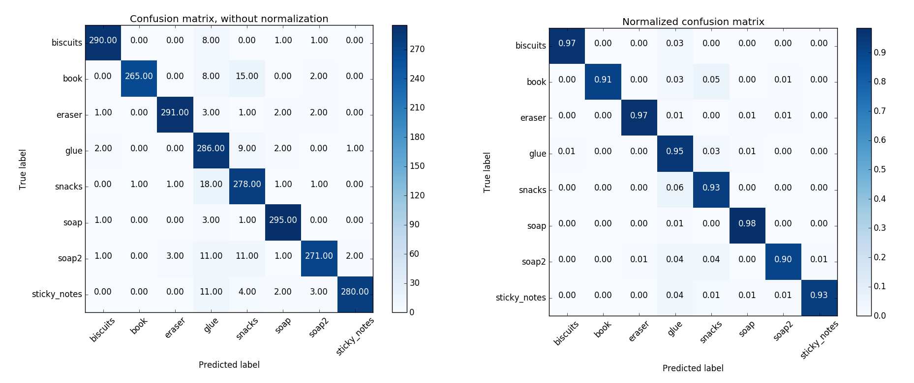
The trained SVM model is saved in model.sav.

### 4. Pick and Place Setup
To perform pick&place task, we need to sent correct command to the pr2 robot. This can be done by creating the necessary ROS messages and sending to the pick_place_routine service. The format of the service message is shown below.     

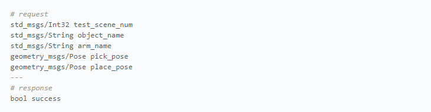

Parameters parsing to the above individual variables can be found in `pr2_mover()` funtion in **`project_template_.py`**.

### 5. Simulation
After implementing the pipeline and pick&place setup, we can intuitively judge the performance of the algorithm in simulation. There are three test scenarios to evaluate the perception performance. All three test results are shown below.

#### scenario 1
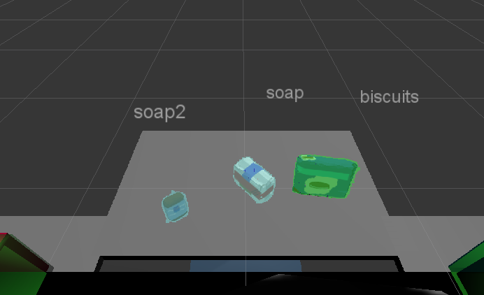

#### scenario 2
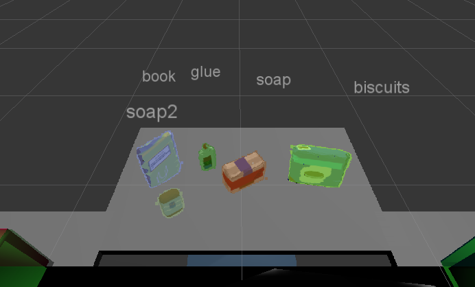

#### scenario 3
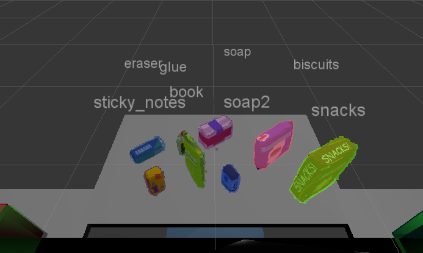